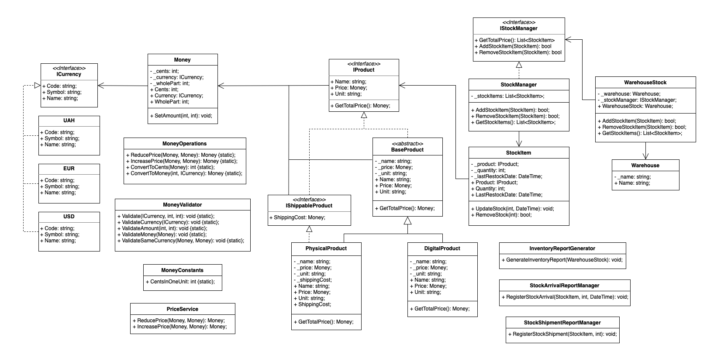

# Product Warehouse

## Дотримані принципи програмування в проекті

### 1. DRY (Don't Repeat Yourself)
**Принцип DRY** означає уникнення дублювання коду шляхом винесення спільної логіки в окремі методи чи класи.
- В мене є клас [MoneyOperations](./ClassLibraryProductWarehouse/Monies/MoneyOperations.cs) для операцій над грошовими значеннями, він був створений для обрахунку збільшення та зниження ціни, але як виявилось логіка методів була дуже схожа, тому я вирішила схожі частинки коду винести в окремі методи ([ConvertToCents](./ClassLibraryProductWarehouse/Monies/MoneyOperations.cs#L37-L40) та [ConvertToMoney](./ClassLibraryProductWarehouse/Monies/MoneyOperations.cs#L42-L47)), завдяки чому вдалось уникнути повторень, прибрати магічні числа та полегшити читабельність коду.      

### 2. KISS (Keep It Simple, Stupid)
**Принцип KISS** передбачає, що код має бути простим та зрозумілим.
- Як було описано в принципі DRY, я розбила два схожих методи в класі [MoneyOperations](./ClassLibraryProductWarehouse/Monies/MoneyOperations.cs), спочатку вони були на небагато рядочків, буд довгий рядок коду який перетворював цілу частину числа в монети, поєднував з копійками і потім рахував вже зменшення або ж збільшення ціни. Тому, я вишішила цей код, який одразу не зрозуміло що і як робить, розбити на менші методи, в результаті головні методи [ReducePrice](./ClassLibraryProductWarehouse/Monies/MoneyOperations.cs#L12-L23) та [IncreasePrice](./ClassLibraryProductWarehouse/Monies/MoneyOperations.cs#L25-L35) стали дуже читабельними, тепер не важливо як вони конвертують гроші в монети і т.д., тепер йде увага саме на те що роблять методи, а не як вони реалізовані. А самі допоміжні методоти конвертації я теж спростила, тим що винесла валідацію в окремий клас [MoneyValidator](./ClassLibraryProductWarehouse/Monies/MoneyValidator.cs).

### 3. SOLID

#### 3.1. Single Responsibility Principle (SRP)
**Принцип SRP** означає, що клас повинен мати лише одну відповідальність.
- Я намагалась зробити всі методи максимально "чистими", які б мали лише одну відповідальність. Наприклад клас [Money](./ClassLibraryProductWarehouse/Monies/Money.cs) зберігає дані про гроші, є методи для отримання та встановлення суми, що сугубо пов'язано з ци класом. Ще є перевизначений метод [ToString](./ClassLibraryProductWarehouse/Monies/Money.cs#L36-L40), окільки це простий проект, то я залишила такі методи напряму в класах, але в мабутньому для більш складного відображення даних класу буде краще робити океремі класи для форматування та виведення даних. Спочатку клас мав ще мотоди для математичних обрахунків, валідації чисел, які я виокремила в два окремі класи: [MoneyOperations](./ClassLibraryProductWarehouse/Monies/MoneyOperations.cs) та [MoneyValidator](./ClassLibraryProductWarehouse/Monies/MoneyValidator.cs).

- Інший клас який теж відповідає принципу - це [Warehouse](./ClassLibraryProductWarehouse/Storage/Warehouse.cs), він сугубо преставляє просто склад. Логіку для пердставлення списку товарів на складі та методи для додавання, видалення виду товару з складу, я винесла в клас [StockManager](./ClassLibraryProductWarehouse/Storage/StockManager.cs). Зв'язок між менеджером запасів та самим складом забезпечує клас [WarehouseStock](./ClassLibraryProductWarehouse/Storage/WarehouseStock.cs). Ще варто зазначити, що товар на складі зберігається через окремий клас [StockItem](./ClassLibraryProductWarehouse/Storage/StockItem.cs), який теж має наче одну відповідальність - це представлення товару на складі, але в класі є два методи: для поповнення кількості товару з датою поповнення, для навпаки відвантаження товару, тобто зменшення кількості на складі; і можливо ці методи теж було б краще виокремити в якийсь менеджер, але мені здається оскільки клас не просто предсталяє товар на складі, але й прив'язаний саме до кількості товару на складі, то залишити ці методи напряму в класі `StockItem` теж нормально.

- Третім з головних класів є клас [BaseProduct](./ClassLibraryProductWarehouse/Product/BaseProduct.cs), який несе відповідальність за представлення товару. Логіку з маніпуляціями ціни (збільшення, зменшення) я винесла в окремий клас [PriceService](./ClassLibraryProductWarehouse/Monies/PriceService.cs). Для того щоб товар міг розширватись цей клас абстрактний і використовує інтерфейс [IProduct](./ClassLibraryProductWarehouse/Product/IProduct.cs), це важливо вказати оскільки в класі є метод [GetTotalPrice](./ClassLibraryProductWarehouse/Product/BaseProduct.cs#L32), який явно пов'язаний з грошима, але в моїй реалізації цей метод залежить він внутрішніх факторів, наприклад похідний клас [PhysicalProduct](./ClassLibraryProductWarehouse/Product/PhysicalProduct.cs) представляє фізичний об'єкт, який буде мати доставку, через яку загальна сума товару збільшится, натомість цифровий товар (клас [DigitalProduct](./ClassLibraryProductWarehouse/Product/DigitalProduct.cs)) не має доставки. Тому цей клас має не зовсім лише одну відповідальність, але допомагає показати дотримання принципу LSP і легко розширювватись завдяки створюванню нових похідних інтерфейсів.
- В інших допоміжних класах теж реалізація з акцентами на дотримання відповідальності за якусь окрему сферу завдань.

#### 3.2. Open/Closed Principle (OCP)
**Принцип OCP** передбачає, що класи повинні бути відкритими для розширення, але закритими для модифікації.
- В мене є базовий абстрактний клас [BaseProduct](./ClassLibraryProductWarehouse/Product/BaseProduct.cs), який дозволяє створювати різні типи продуктів ([DigitalProduct](./ClassLibraryProductWarehouse/Product/DigitalProduct.cs), [PhysicalProduct](./ClassLibraryProductWarehouse/Product/PhysicalProduct.cs)), не змінюючи сам клас [BaseProduct](./ClassLibraryProductWarehouse/Product/BaseProduct.cs). Також вткористовуються похідні інтерфейси від [IProduct](./ClassLibraryProductWarehouse/Product/IProduct.cs), наприклад, [IShippableProduct](./ClassLibraryProductWarehouse/Product/IShippableProduct.cs), що дозволяє ще більш гнучко розширювати класи.
- Також систему валют реалізувала через загальний ітерфейс [ICurrency](./ClassLibraryProductWarehouse/Currency/ICurrency.cs) від якого можна легко додавати нові класи валют, розширюючи список валют, але не зачіпаючи існуючий функціонал.

#### 3.3. Liskov Substitution Principle (LSP)
**Принцип LSP** означає, що об'єкти похідних класів можуть використовуватися замість базових без змін у коректності роботи коду.
- Класи ([DigitalProduct](./ClassLibraryProductWarehouse/Product/DigitalProduct.cs) та [PhysicalProduct](./ClassLibraryProductWarehouse/Product/PhysicalProduct.cs) є підкласами [BaseProduct](./ClassLibraryProductWarehouse/Product/BaseProduct.cs) і хоча вони похідні, вони не змінюють поведінку батьківського класу. Це вдалося зявдяки тому що, наприклад, метод для обрахунку загальної вартості який відрізняється в різних класах, перевизначається, але не змінює загальної логіки базавого методу. Таку гнучкість допомогли досягти інтерфейси, які були описані в минулому принципі.

#### 3.4. Interface Segregation Principle (ISP)
**Принцип ISP** передбачає, що інтерфейси повинні бути розділені, щоб клієнти залежали лише від необхідних їм методів.
- Я використала окремі інтерфейси [IProduct](./ClassLibraryProductWarehouse/Product/IProduct.cs) і [IShippableProduct](./ClassLibraryProductWarehouse/Product/IShippableProduct.cs), щоб розділити функціональність, перший метод загально представляє майбутню реалізацію товару, другий уже конкретезуює вид товару, в майбутньому можна і далі розділяти особливості різних товарів через реалізаціїї інтерфейсів.

#### 3.5. Dependency Inversion Principle (DIP)
**Принцип DIP** означає, що залежності повинні бути спрямовані на абстракції, а не на конкретні реалізації.
- Клас [Warehouse](./ClassLibraryProductWarehouse/Storage/Warehouse.cs) використовує [IStockManager](./ClassLibraryProductWarehouse/Storage/IStockManager.cs), завдяки цьому можна легко за потреби підключити іншу реалізацію менеджера складу.

### 4. YAGNI (You Ain't Gonna Need It)
**Принцип YAGNI** означає, що слід реалізовувати тільки необхідну функціональність, уникаючи передчасного ускладнення.
- Стосовно цього принципу, я як завжи не робила кучу блоків закоментованого коду, який або може стати в нагоді потім, або минулі версії методів, які правильніше звітувати через `git`. Також, спочатку проектування проекту хотіла зробити поле в класі [Money](./ClassLibraryProductWarehouse/Monies/Money.cs) для курсу валют, потім зрозуміла, що оскількі валют декілька треба робити окремим класом ці обміни і зрозуміла, що замість реалізації базової структури я почала ускладнювати проект, тому вирішила прибрати цю логіку.

### 5. Composition Over Inheritance
**Принцип "Композиція понад наслідування"** рекомендує використовувати композицію замість глибокого наслідування.
- Клас [StockItem](./ClassLibraryProductWarehouse/Storage/StockItem.cs) використовує [IProduct](./ClassLibraryProductWarehouse/Product/IProduct.cs) як властивість, а не наслідується від нього, така реалізація є і більш логічною, окільки на склад будуть приходити різні типи товарів і цей клас представляє форму подання товару на складі, але не є прям самим товаром. Так само клас [Money](./ClassLibraryProductWarehouse/Monies/Money.cs) використовує [ICurrency](./ClassLibraryProductWarehouse/Monies/ICurrency.cs), окільки валюта це не сами гроші, а одна з характеристик. Така реалізація дає змогу змінювати валюту і не прив'язувати клас `Money` до якоїсь валюти або ж робити похідні класи від класу `Money` для кожної валюти. Це допомогло наслідувати принцип HAS-A, замість IS-A. 

### 6. Fail Fast
**Принцип "Швидкий провал"** передбачає швидке виявлення помилок.
- Для швидкого виявлення помилок, в ріних місцях програми я додала валідацію. Клас [MoneyValidator](./ClassLibraryProductWarehouse/Monies/MoneyValidator.cs) перевіряє коректність поданих даних, що дозволить швидше виявити помилки через `Exceptions`.
